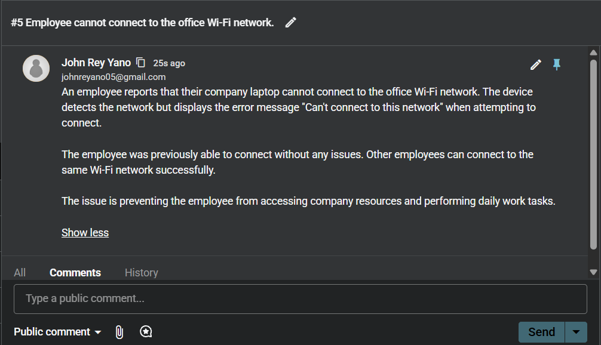
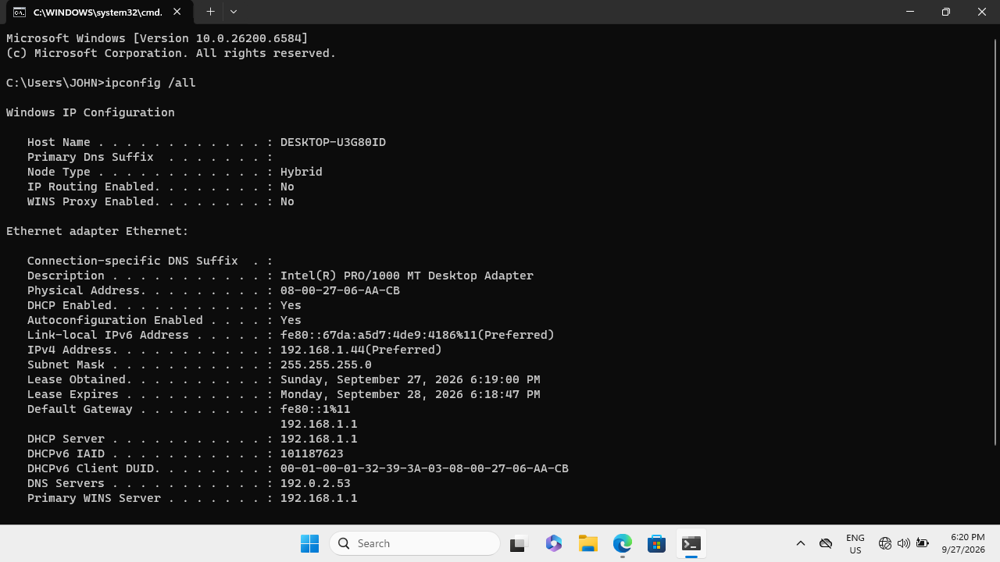
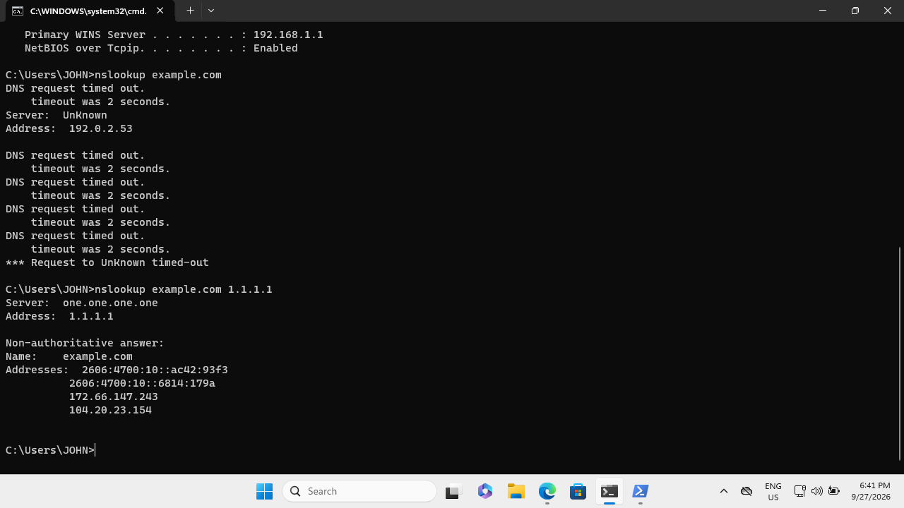
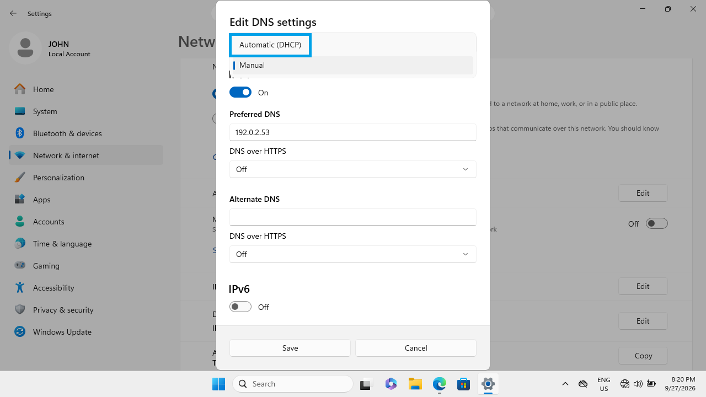

# Ticket #001: Office Workstation Internet Connection Issue

## 1. Ticket Information



## 2. Problem Description

An employee reported that their office workstation was connected to the network but could not access websites.

Other employees were able to access the internet without any issues, suggesting that the problem was isolated to the affected workstation.

## 3. Troubleshooting Process

### Step 1: Initial Internet Connectivity Check

The first step was to investigate the reported internet connectivity issue.

A web browser was used to check whether the workstation could access websites.


### Step 2: Inspect Network Configuration

The following command was executed in Command Prompt:

```cmd
ipconfig /all
```


### Step 3: Test Internet Connectivity

To determine whether the workstation could communicate with an external server, the following command was executed in PowerShell:

```powershell
Test-NetConnection 1.1.1.1 -Port 443
```


The successful TCP connection confirmed that the workstation could reach an external server on port 443.

This suggested that the problem was not a complete loss of internet connectivity.

### Step 4: Investigate DNS Resolution

The next step was to determine whether the workstation could resolve domain names.

The following command was executed:

```cmd
nslookup example.com
```


The configured DNS server failed to respond to the DNS request.

To verify whether the issue was isolated to the configured DNS server, another DNS lookup was performed using Cloudflare's public DNS server.

```cmd
nslookup example.com 1.1.1.1
```
This command successfully returned IP addresses for `example.com`.

**Findings:**

- The configured DNS server failed to respond.
- An alternative DNS server successfully resolved the domain.
- General internet connectivity was functioning.

These results strongly indicated that the workstation's DNS configuration was responsible for the reported issue.

## 5. Root Cause Analysis

The workstation was configured to use an incorrect DNS server: `192.0.2.53`.

DNS translates domain names, such as `example.com`, into IP addresses that computers use to communicate over a network.

Because the configured DNS server did not respond, the workstation was unable to resolve domain names through its normal DNS configuration.

Although the workstation could establish a direct connection to an external IP address, DNS resolution failed when using its configured server.

**Root Cause:** Incorrect DNS server configuration.

## 6. Resolution

### Step 1: Correct the DNS Configuration

The workstation's network settings were accessed through:

**Settings > Network & Internet > Ethernet > DNS Server Assignment > Edit**

The DNS server assignment was changed from Manual to Automatic (DHCP).

This allowed the workstation to obtain its DNS configuration automatically rather than using the incorrect manually configured DNS server.



### Step 2: Verify Network Configuration

After applying the changes, the network configuration was checked again using:

```cmd
ipconfig /all
```

The DNS server information was reviewed to confirm that the incorrect DNS configuration had been replaced.

.png)

### Step 3: Verify DNS Resolution

The following command was executed again:

```cmd
nslookup example.com
```

This time, the DNS lookup successfully resolved the domain name using the restored DNS configuration.

.png)

### Step 4: Verify Website Accessibility

A web browser was opened to confirm that the workstation could access websites normally.

The website `example.com` loaded successfully, confirming that domain name resolution and web access had been restored.

.png)


