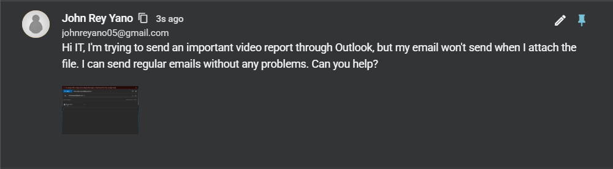
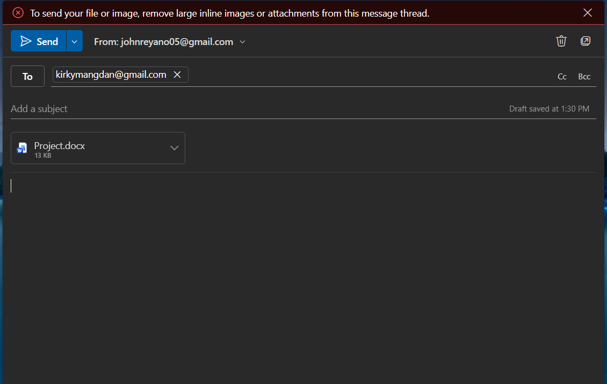
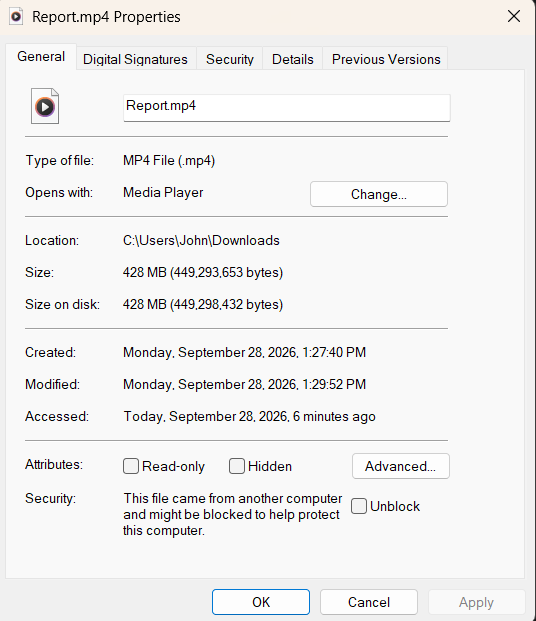
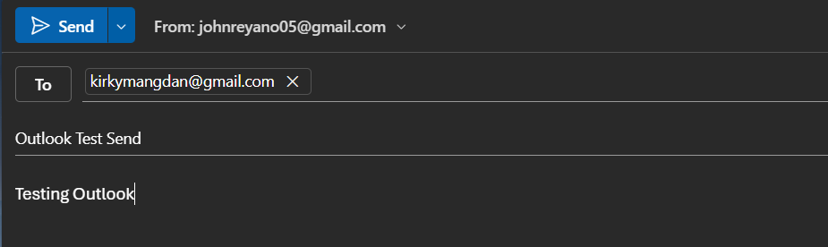
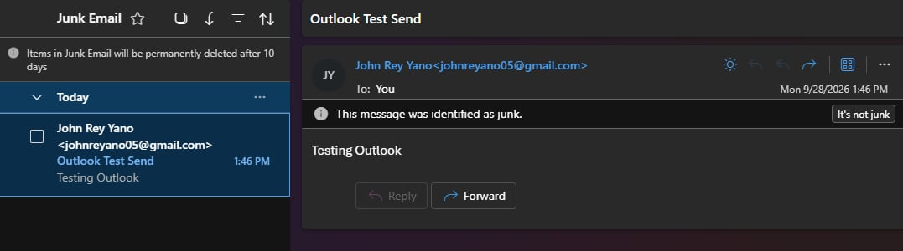
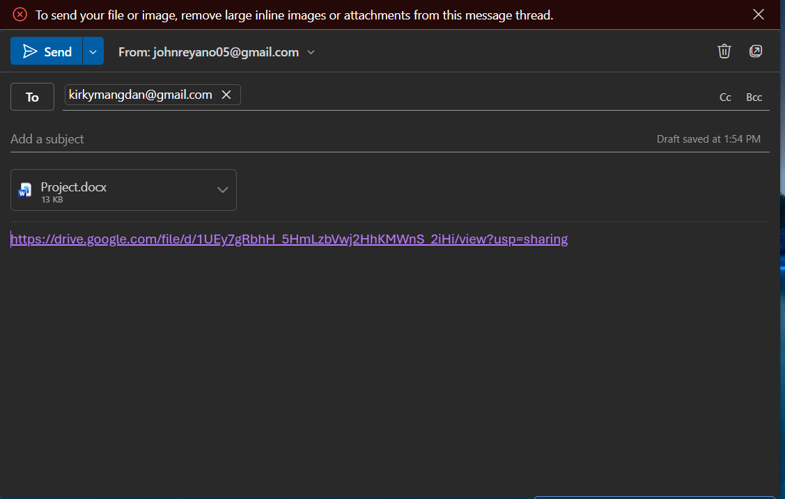

# Ticket #002: Outlook Email Failure — Large Attachment

## 1. Problem Description

An employee contacted IT Support after experiencing difficulties sending an email through Microsoft Outlook.

The employee attempted to send an email containing an attachment approximately 450 MB in size. However, the email could not be sent.

The IT Help Desk was tasked with investigating the issue, identifying the cause, and providing an alternative method for sharing the large file.

### Ticket Creation

A ticket was created in Spiceworks to document the employee's reported email issue and track the troubleshooting process.

---

## 2. Troubleshooting Process

### Step 1: Investigate the Failed Email

The employee reported being unable to send an email containing an attachment.

An attempt was made to send the email with the large attachment.

The email could not be sent with the attachment included.

During investigating the failed email, I checked the file the user want to sent is 428MB which is beyond the limit of the onedrive email size.

### Step 2: Test Normal Email Functionality

To determine whether the problem affected all outgoing emails, a separate test email was prepared without the large attachment.

The test was intended to establish whether Outlook could send regular emails.

### Step 3: Verify Email Delivery

The test email was sent successfully without the large attachment.

This confirmed that Outlook's basic email-sending functionality was working.

The issue was therefore associated with the large attachment rather than a general inability to send emails.

---

## 3. Root Cause Analysis

The attachment was approximately 428 MB, exceeding the attachment size limit supported by the email configuration.

Email services typically enforce attachment size limits to manage server resources and prevent excessively large messages.

The successful transmission of a normal email demonstrated that Outlook's basic sending functionality was operational.

**Root Cause:** The attachment exceeded the permitted email attachment size.

## 4. Resolution

### Step 1: Use Google Drive

Instead of sending the 428 MB file as a traditional email attachment, Google Drive was used as an alternative file-sharing solution.

A Google Drive sharing link was created so the employee could share the large file without attaching it directly to an email.

### Step 2: Generate a Sharing Link

The large file was placed in Google Drive, and a sharing link was generated.

The sharing link could then be included in an Outlook email, allowing the intended recipient to access the file through OneDrive.

Appropriate sharing permissions should be configured according to the organization's file-sharing policies.

### Step 3: Provide the Solution

The employee was instructed to use the OneDrive sharing link instead of attaching the large file directly to the email.

This approach avoids the traditional email attachment size restriction while allowing the file to be shared.

---

## 7. Final Resolution Summary

| Item | Result |
|---|---|
| Reported Issue | Unable to send an email with a large attachment |
| Attachment Size | Approximately 428 MB |
| Root Cause | Email attachment size limit |
| Troubleshooting | Tested email sending without the attachment |
| Resolution | Used Google Drive to share the large file |
| Verification | Normal email sent successfully |
| Final Status | Resolved |

The email issue was addressed by providing Google Drive as an alternative file-sharing method.

The successful normal email test confirmed that Outlook's basic sending functionality was working.

Using a Google Drive link allowed the large attachment to be shared without including the file directly in the email.

